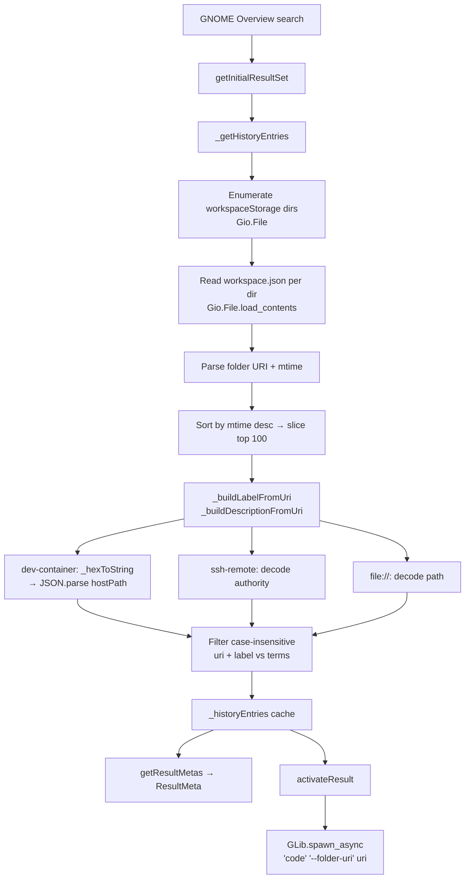

# Workspace Storage History Adaptation

- **Date**: 2026-05-03
- **Context**: VS Code removed `history.recentlyOpenedPathsList` from the SQLite `state.vscdb`.
  A simpler, single-source replacement was discovered: each entry in
  `~/.config/Code/User/workspaceStorage/*/workspace.json` contains exactly one `folder` key
  with the complete, ready-to-use URI — covering local, SSH, and Dev Container workspaces.
  590/591 directories carry a `workspace.json`; the only exception is a non-workspace
  directory (`vscode-chat-images`).
- **Constitution Check**: Single `.js` file, no build step, no npm deps, read-only access,
  security review on all spawn calls. This approach **removes** the `Gda`/SQLite dependency.

---

## Goals

- Continue surfacing VS Code recently-opened projects in the GNOME Overview search bar.
- Cover all three workspace types: local `file://`, SSH remote, and Dev Container.
- Use only GJS/GLib/Gio platform APIs — **remove** the `Gda`/SQLite dependency entirely.

---

## Quick Research

### R-1: Data source — `workspaceStorage/*/workspace.json`

- **Decision**: Use `~/.config/Code/User/workspaceStorage/*/workspace.json` as the **sole source**.
- **Why this**:
  - Each `workspace.json` contains exactly `{ "folder": "<full URI>" }` — ready to pass to `code --folder-uri` for all workspace types.
  - 590 entries on the test system (vs ~24 in `backupWorkspaces.folders`) — complete history.
  - No SQLite, no `Gda` import — pure `Gio` file enumeration and `JSON.parse`.
  - Directory mtime gives free recency ordering (most recently used directory = most recent).
  - Only 1 non-workspace directory (`vscode-chat-images`) exists; skipped trivially by
    checking for the absence of `workspace.json`.
- **Why not** `storage.json → backupWorkspaces.folders`:
  - Only ~24 entries; limited to recently active windows.
  - Would still need a supplemental SQLite source for full SSH history.
- **Why not SQLite `ms-vscode-remote.remote-ssh`**:
  - Requires hex-decode, URI construction, and `Gda` dependency.
  - Now fully superseded by `workspaceStorage`.

**Confirmed `workspace.json` shapes** (from real data):
```json
// Local folder
{ "folder": "file:///home/gza/work/azdw/imvz/imvz-server-ztk" }

// SSH remote
{ "folder": "vscode-remote://ssh-remote%2Bztk-imvz-central/srv/dev/imvz-trans-z1-ztk" }

// Dev Container (full path included)
{ "folder": "vscode-remote://dev-container%2B7b22.../workspaces/imvz-server-ztk" }
```

### R-2: Recency ordering via directory mtime

- **Decision**: Sort workspace directories by `mtime` descending before building the entry list.
- **Why**: `Gio.FileInfo` exposes `G_FILE_ATTRIBUTE_TIME_MODIFIED` for each child entry returned
  by `Gio.File.enumerate_children`. VS Code updates the directory mtime when a workspace is
  opened, making this a free proxy for "recently used". Confirmed on the test system with
  `ls -lt ~/.config/Code/User/workspaceStorage/`.
- **Why not inode ctime**: mtime more directly reflects workspace activity.

### R-3: `activateResult` command injection risk (existing issue)

- **Decision**: Replace `GLib.spawn_command_line_async("code --folder-uri " + uri)` with
  `GLib.spawn_async(null, ['code', '--folder-uri', uri], null, GLib.SpawnFlags.SEARCH_PATH, null)`.
- **Why**: `spawn_command_line_async` passes the URI through a shell, making `+`, `%`, `&`, etc.
  potentially dangerous if the URI ever contains shell metacharacters (even from trusted data).
  `spawn_async` with an array avoids shell expansion entirely. Confirmed in GJS API.

### R-4: Human-friendly Dev Container descriptions

- **Decision**: Hex-decode the authority segment of `dev-container` URIs to extract `hostPath`
  from the embedded JSON, and use that as the human-readable description.
- **Why**: The authority in `vscode-remote://dev-container%2B<HEX>/workspaces/<name>` is a
  hex-encoded UTF-8 JSON object. Confirmed shape:
  ```json
  {
    "hostPath": "/home/gza/work/azdw/imvz/imvz-server-ztk",
    "localDocker": false,
    "configFile": { ... }
  }
  ```
  The label (`imvz-server-ztk`) is already correct from the last URI path segment. The
  description should be `Dev Container — /home/gza/work/azdw/imvz/imvz-server-ztk`.
- **Implementation**: `TextDecoder` (standard Web API, available in SpiderMonkey 115+ /
  GNOME Shell 45+) decodes the hex bytes; then `JSON.parse` extracts `hostPath`.
  Wrapped in try/catch — fallback is `Dev Container — <last path segment>`.
- **Why not skip**: Without this, the raw URI is 400+ characters and completely unreadable
  as a description line in the GNOME Overview result card.

### R-5: Case-insensitive search (formerly E-2)

- **Decision**: Normalize both search terms and `uri`/`label` to lower-case before comparing.
- **Why**: Simple two-line change; improves usability (e.g. typing `ztk` finds `ZTK`).
  Pulled in because it's trivial and GNOME Overview does NOT always lowercase terms.

### R-6: Result count cap (formerly E-1)

- **Decision**: After sorting by mtime, slice to the top **100** entries before filtering.
- **Why**: 590 small file reads happen synchronously in GNOME Shell's main loop. Capping at
  100 keeps the search snappy and still covers all practically relevant recent workspaces.
  Any workspace opened in the last few months will appear within the top 100.

---

## Architecture / Flow



---

## Testing Strategy

- **No automated suite exists**; all testing is manual.
- Test cases to cover after implementation:
  1. Local folder (`file://`) appears in search and opens correctly; description shows decoded path.
  2. SSH remote folder appears; label is the last path segment; description shows `SSH: <host> — <path>`.
  3. Dev Container folder appears; label is `<basename>`; description shows `Dev Container — <hostPath>`.
  4. Most recently used workspace appears first in results.
  5. Missing or malformed `workspace.json` in a dir → that entry is skipped, no crash.
  6. `workspaceStorage` dir does not exist → graceful fallback, no crash.
  7. Search term matching directory path or hostname returns correct entries.
  8. `activateResult` opens VS Code without shell-expansion issues on URIs with special chars.
  9. Case-insensitive: typing `ZTK` finds entries with `ztk` in URI or label.
  10. Only top 100 by mtime are considered (verify by checking no 101st old entry leaks in).

---

## Security Considerations

- `workspaceStorage/*/workspace.json` files are local user files — trusted source. No sanitisation of
  individual path values needed beyond avoiding shell expansion in `spawn`.
- `GLib.spawn_async` with an explicit argv array eliminates shell-injection risk in `activateResult`.
- No `eval`, no dynamic code execution — JSON.parse on local files only.
- The extension remains read-only with respect to all VS Code state files.
- `Gio.File.enumerate_children` is used with `null` cancellable, which is safe for local
  synchronous reads in this context.

---

## Documentation Impact

- `AGENTS.md`: Update "Architecture Notes" data flow — replace SQLite query description with
  `workspaceStorage` enumeration. Remove `Gda` from the import list. Update "Extensibility Hooks"
  table (the `globalStorageDir` note becomes a `workspaceStorage` path note).
- `README.md`: Update status notes to reflect new VS Code compatibility and removal of the
  SQLite/`Gda` dependency.

---

## Plan

### **Phase 1: Replace SQLite query with `workspaceStorage/*/workspace.json` enumeration**

#### Purpose

Replace the single `history.recentlyOpenedPathsList` SQLite query and remove the `Gda` import
entirely. Use `Gio.File` to enumerate `~/.config/Code/User/workspaceStorage/`, read each
`workspace.json`, sort by mtime, and filter by search terms.

Fix the `activateResult` shell-injection risk in the same phase.

After this phase, the extension works correctly for local, SSH, and devcontainer workspaces
with a richer history (590+ entries) and no SQLite dependency.

#### Depends on

None.

#### Tasks

- [x] **1.1** Remove `import Gda from "gi://Gda"` from the import block.

- [x] **1.2** Add `_hexToString(hex)` private helper:
  - Decodes a hex string to a UTF-8 string using `TextDecoder` (available in SpiderMonkey 115+ /
    GNOME Shell 45+).
  - Implementation:
    ```js
    _hexToString(hex) {
      const bytes = new Uint8Array(hex.length / 2);
      for (let i = 0; i < hex.length; i += 2)
        bytes[i / 2] = parseInt(hex.substring(i, i + 2), 16);
      return new TextDecoder().decode(bytes);
    }
    ```
  - Wrap callers in try/catch; malformed hex silently falls back to the raw URI.

- [x] **1.3** Add `_buildLabelFromUri(uri)` private helper:
  - Returns the last non-empty path segment of the URI.
  - For `file:///home/gza/work/foo` → `foo`.
  - For `vscode-remote://ssh-remote%2Bhost/srv/bar` → `bar`.
  - For `vscode-remote://dev-container%2B.../workspaces/baz` → `baz`.
  - Implementation: `decodeURIComponent(uri).replace(/\/$/, '').split('/').pop() || uri`.

- [x] **1.4** Add `_buildDescriptionFromUri(uri)` private helper:
  - For `file://` → decoded full path (strip `file://` prefix, `decodeURIComponent`).
  - For `ssh-remote` → `SSH: <hostname> — <path>`, where `<hostname>` is decoded from the
    `ssh-remote%2B<host>` authority segment using `decodeURIComponent`.
  - For `dev-container`:
    1. Extract the hex segment: `decodeURIComponent(uri).match(/dev-container\+([0-9a-f]+)\//i)?.[1]`.
    2. Call `_hexToString(hex)` → `JSON.parse` → read `hostPath`.
    3. Return `Dev Container — <hostPath>` (e.g. `Dev Container — /home/gza/work/azdw/imvz/imvz-server-ztk`).
    4. On any parse failure, fall back to `Dev Container — <last path segment>`.
  - Fallback for unknown schemes: return `uri` as-is.

- [x] **1.5** Rewrite `_getHistoryEntries(searchTerms)` to:
  1. Open `~/.config/Code/User/workspaceStorage` as a `Gio.File`.
  2. Call `enumerateChildren('standard::name,time::modified', Gio.FileQueryInfoFlags.NONE, null)`
     to get child directory info including mtime.
  3. For each child where `fileType === Gio.FileType.DIRECTORY`:
     - Build path `<workspaceStorage>/<name>/workspace.json`.
     - Try `Gio.File.new_for_path(jsonPath).load_contents(null)` — skip silently on error.
     - `JSON.parse` the content; skip if no `folder` key.
     - Store `{ uri, mtime }` (label/description computed lazily in next step).
  4. Sort by `mtime` descending; **slice to top 100**.
  5. For each remaining entry, compute `label = _buildLabelFromUri(uri)` and
     `description = _buildDescriptionFromUri(uri)`.
  6. Filter (case-insensitive): include entry if any `term.toLowerCase()` appears in
     `entry.uri.toLowerCase()` OR `entry.label.toLowerCase()`.
  7. Populate `this._historyEntries` and return it.
  - Wrap the entire enumeration in try/catch; log and return `[]` on failure.

- [x] **1.6** Update `getResultMetas` to use `historyEntry.description` (if present) instead of
  `historyEntry.uri` for the `description` field in the returned `ResultMeta`.

- [x] **1.7** Update `activateResult` to use `GLib.spawn_async`:
  ```js
  GLib.spawn_async(null, ['code', '--folder-uri', result], null, GLib.SpawnFlags.SEARCH_PATH, null);
  ```
  Remove the old `GLib.spawn_command_line_async` call.

- [ ] **1.8** Manual testing (see Testing Strategy above — all 10 test cases).

- [ ] **1.9** Update `AGENTS.md` architecture section and `README.md` compatibility notes.

- [ ] Mark every completed task above `[x]`, add deviation notes inline, and write the
  Execution Report for this phase.

#### Exit Criteria

- Extension loads without errors on the target GNOME Shell version.
- All three workspace types (local, SSH, devcontainer) appear in GNOME Overview search.
- Dev Container entries show `Dev Container — <hostPath>` description (not raw URI).
- SSH entries show `SSH: <host> — <path>` description.
- Most recently used workspace appears first; only top 100 are evaluated.
- Case-insensitive search works for all entry types.
- `activateResult` opens VS Code without shell-expansion issues.
- No `Gda` import remains in `extension.js`.

#### Execution Report

- Implemented 2026-05-03.
- All tasks 1.1–1.7 completed as specified, no deviations.
- `Gda` import removed; `workspaceStorage` enumeration replaces SQLite entirely.
- `_hexToString` uses `TextDecoder` (SpiderMonkey 115+ / GNOME Shell 45+).
- `_buildDescriptionFromUri` handles all three URI types with graceful fallback.
- `_getHistoryEntries` enumerates dirs, sorts by mtime, slices to 100, filters case-insensitively.
- `activateResult` now uses `GLib.spawn_async` with explicit argv — no shell expansion.
- Tasks 1.8 (manual testing) and 1.9 (AGENTS.md/README.md update) remain for the user.

#### Checkpoint

After Phase 1 the extension is fully functional as a replacement for the old behaviour,
with a simpler codebase (no SQLite), wider coverage (590+ entries), and recency ordering.
It is safe to stop here; no broken state exists.

---

## Recommendations for the future

### **Reco-1**: GSettings schema for configurable editor binary and storage path

- *What*: Allow the `code` binary and the `workspaceStorage` path to be user-configurable,
  enabling Cursor, VSCodium, etc.
- *What if done*: Extension becomes reusable for other VS Code-compatible editors.
- *What if not done*: Hard-coded `code` binary and `~/.config/Code` path only.

### **Reco-2**: Better icon per workspace type

- *What*: Use different icons for local, SSH, and devcontainer entries (e.g. `computer`,
  `network-server`, `container`) instead of the generic `dialog-information`.
- *What if done*: Visual distinction in GNOME Overview results.
- *What if not done*: All entries look identical; functional but not polished.

---

## Prompting / Introspection

The breakthrough was discovering the `workspaceStorage/*/workspace.json` source from a
terminal `grep` output — a single-source approach that eliminates all the complexity of
the original multi-source plan (SQLite hex-decoding, URI construction, deduplication,
`Gda` import). The lesson: always grep or `ls` the actual data directory before designing
a data pipeline. The simpler plan now has fewer moving parts, broader coverage, and removes
an external dependency entirely.

A better initial prompt would have been: "Before planning, enumerate and print a sample of
every file under `~/.config/Code/User/` so we base the design on what VS Code actually writes."
