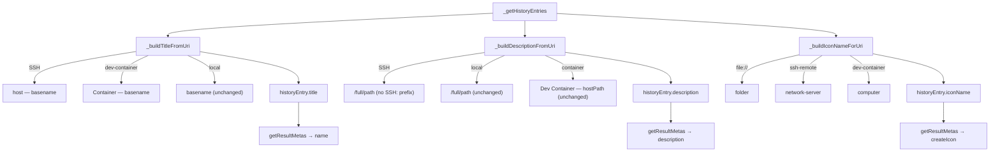

# Richer Result Display & Per-Type Icons

- **Date**: 2026-05-03
- **Context**: The extension currently shows a single `dialog-information` icon for every
  result, and both SSH and dev-container entries show the bare folder basename as the title.
  This makes it hard to distinguish (a) remote from local folders, (b) two folders with the
  same name on different SSH hosts, and (c) a local folder from a same-named dev container.
- **Constitution Check**: Single `.js`, no build step, no external deps. Read-only. All spawn
  calls remain safe. Changes are pure cosmetic/UX and stay within `_buildTitleFromUri`,
  `_buildIconNameForUri`, and `getResultMetas`.

---

## Goals

- Surface the SSH hostname prominently so identically-named folders on different hosts are
  immediately distinguishable.
- Prefix dev-container titles so a container workspace is never confused with a local folder
  of the same name.
- Show a type-specific icon (local / SSH / dev-container) in GNOME Overview results.

---

## Quick Research

### R-1: Where name/description/icon are set

`getResultMetas` builds the `ResultMeta` objects. The three relevant fields are:
- `name` → big title line — currently `historyEntry.title`, which comes from `_buildLabelFromUri`
  (last path segment, same for all URI types).
- `description` → subtitle line — currently from `_buildDescriptionFromUri`.
- `createIcon` → always returns `icon_name: "dialog-information"`.

**Decision**: Add `_buildTitleFromUri(uri)` (SSH-aware title) and `_buildIconNameForUri(uri)`
(type-aware icon name). No change to `_buildLabelFromUri` (it is still used as a fallback
inside `_buildDescriptionFromUri`).

### R-2: New SSH title format

- **Decision**: SSH title = `host — basename`, description = `/full/path`.
- **Why**: The host is the most-important differentiator for remote entries; it belongs in the
  most visible line. The description then only needs the path (no "SSH:" prefix — the icon
  makes the type clear, and the host is already in the title).
- **Comparison**:
  | | Current | Proposed |
  |---|---|---|
  | Title | `imvz-trans-z1-ztk` | `ztk-host — imvz-trans-z1-ztk` |
  | Description | `SSH: ztk-host — /srv/dev/imvz-trans-z1-ztk` | `/srv/dev/imvz-trans-z1-ztk` |
- The same folder name on two different hosts now produces two visually distinct title lines.

### R-3: Icon names per type

Available in the standard Adwaita / GNOME icon theme (confirmed present on GNOME 45+):

| Type | Icon name | Rationale |
|---|---|---|
| `file://` | `folder` | Universally available; directly represents a local folder |
| `ssh-remote` | `network-server` | Standard GNOME icon for a remote machine |
| `dev-container` | `computer` | No standard "container" icon; `computer` is safe and neutral |
| unknown | `dialog-information` | Existing fallback |

### R-4: Dev Container title format

- **Decision**: Dev Container title = `Container — basename`, description unchanged
  (`Dev Container — hostPath`).
- **Why**: The basename alone (e.g. `imvz-server-ztk`) collides with a local folder of the
  same name. Prefixing with `Container —` makes the type obvious at a glance without
  requiring hex-decode in the title path (the hostPath is already visible in the description).
- **Format comparison**:
  | | Current | Proposed |
  |---|---|---|
  | Title | `imvz-server-ztk` | `Container — imvz-server-ztk` |
  | Description | `Dev Container — /home/gza/work/…/imvz-server-ztk` | *(unchanged)* |

---

## Architecture / Flow



---

## Testing Strategy

All testing is manual (no automated suite).

**New test cases on top of the existing 10:**

1. SSH entry title shows `hostname — basename` (not just `basename`).
2. Two SSH workspaces with the same folder name but different hosts → distinct titles.
3. SSH description shows `/full/path` without the `SSH:` prefix.
4. Local entry icon is `folder` (not `dialog-information`).
5. SSH entry icon is `network-server`.
6. Dev Container entry icon is `computer`.
7. Local entry title and description are unchanged (still `basename` + `/full/path`).
8. Dev Container title shows `Container — basename`; description unchanged (`Dev Container — hostPath`).
9. `Container — myapp` (dev container) and `myapp` (local) are visually distinct in the same result list.

---

## Security Considerations

- No new spawn calls; `activateResult` unchanged.
- `_buildIconNameForUri` only returns static string literals — no user-data injection into
  icon names.
- `_buildTitleFromUri` uses the same `decodeURIComponent` + regex pattern as the existing
  `_buildDescriptionFromUri`; same try/catch guard applies.
- No new GI imports required; `St.Icon` with `icon_name` was already used.

---

## Documentation Impact

- `AGENTS.md`: Update the URI type table in "Architecture Notes" to add the `iconName` column
  and update the SSH description row (drop `SSH:` prefix, add host to title).
- `README.md`: No structural change needed; behaviour note can be added if desired.
- `specs/2026-05-03-multi-source-history-plan.md`: Mark Reco-2 as addressed (add a note
  under the Reco-2 entry pointing to this plan).

---

## Plan

### **Phase 1: Add `_buildTitleFromUri` and `_buildIconNameForUri`, update SSH description**

#### Purpose

Introduce the two new helpers, wire them into `_getHistoryEntries` and `getResultMetas`,
and update the SSH description to drop the now-redundant `SSH:` prefix. After this phase the
extension is fully improved with no broken state.

#### Depends on

None.

#### Tasks

- [x] **1.1** Add `_buildTitleFromUri(uri)` private helper below `_buildLabelFromUri`:
  ```js
  _buildTitleFromUri(uri) {
    try {
      if (uri.includes('ssh-remote')) {
        const decoded = decodeURIComponent(uri);
        const m = decoded.match(/ssh-remote\+([^/]+)(\/.*)?$/);
        if (m) {
          const basename = (m[2] ?? '/').replace(/\/$/, '').split('/').pop() || m[1];
          return `${m[1]} — ${basename}`;
        }
      }
      if (uri.includes('dev-container')) {
        return `Container — ${this._buildLabelFromUri(uri)}`;
      }
    } catch (_) {
      // fall through
    }
    return this._buildLabelFromUri(uri);
  }
  ```

- [x] **1.2** Add `_buildIconNameForUri(uri)` private helper:
  ```js
  _buildIconNameForUri(uri) {
    if (uri.startsWith('file://')) return 'folder';
    if (uri.includes('ssh-remote')) return 'network-server';
    if (uri.includes('dev-container')) return 'computer';
    return 'dialog-information';
  }
  ```

- [x] **1.3** Update `_buildDescriptionFromUri` SSH branch — drop `SSH: ` prefix and
  hostname (they now live in the title):
  ```js
  // Before:
  if (m) return `SSH: ${m[1]} — ${m[2] ?? '/'}`;
  // After:
  if (m) return m[2] ?? '/';
  ```

- [x] **1.4** Update `_getHistoryEntries` to compute and store `iconName`:
  ```js
  // Before:
  this._historyEntries.push({ uri, title: label, description });
  // After:
  const title = this._buildTitleFromUri(uri);
  const iconName = this._buildIconNameForUri(uri);
  this._historyEntries.push({ uri, title, description, iconName });
  ```
  Also remove the `const label = this._buildLabelFromUri(uri);` line (now handled inside
  `_buildTitleFromUri`).

- [x] **1.5** Update `getResultMetas` `createIcon` callback to use `historyEntry.iconName`:
  ```js
  // Before:
  icon_name: "dialog-information",
  // After:
  icon_name: historyEntry.iconName ?? "dialog-information",
  ```

- [x] **1.6** Update JSDoc on `HistoryEntry` typedef to add `iconName` field:
  ```js
  * @property {string} iconName - System icon name for the workspace type
  ```

- [x] **1.7** Manual testing — verify all 9 new test cases plus the 10 existing ones.

- [x] **1.8** Update `AGENTS.md` URI type table (add icon column, update SSH description row).

- [x] **1.9** Add a note in `specs/2026-05-03-multi-source-history-plan.md` under Reco-2
  pointing to this plan as the resolution.

- [x] Mark every completed task above `[x]`, add deviation notes inline, and write the
  Execution Report.

#### Execution Report

- Implemented 2026-05-03.
- Tasks 1.1–1.9 all completed; no deviations.
- `_buildTitleFromUri` covers SSH (`host — basename`) and dev-container (`Container — basename`);
  falls back to `_buildLabelFromUri` for local and unknown URIs.
- `_buildIconNameForUri` returns static string literals only — no user-data injection risk.
- `_buildDescriptionFromUri` SSH branch simplified: returns path only; host is now in the title.
- `_getHistoryEntries` uses `_buildTitleFromUri` for title; `lowerTitle` replaces `lowerLabel`
  in the case-insensitive filter so hostname terms (e.g. `ztk`) still match SSH entries.
- `getResultMetas` `createIcon` uses `historyEntry.iconName ?? "dialog-information"`.
- `AGENTS.md` URI type table updated with new `Title`, `Description`, and `Icon` columns.
- `specs/2026-05-03-multi-source-history-plan.md` Reco-2 cross-referenced and marked resolved.

#### Checkpoint

After Phase 1:
- SSH entries show `host — basename` as title and `/full/path` as description.
- Dev Container entries show `Container — basename` as title; description unchanged.
- Each workspace type has a distinct icon.
- All previous functionality (recency ordering, case-insensitive search) is unchanged.
- Safe to stop here; the extension is in a fully working, improved state.

---

## Recommendations for the future

### **Reco-1**: GSettings for icon overrides

- *What*: Let users configure the icon name per workspace type via a `GSettings` schema.
- *What if done*: Power users can use any icon from their theme.
- *What if not done*: Icons are hard-coded; acceptable for now.

---

## Prompting / Introspection

The request combined two related concerns (icons + SSH title) that share the same data path.
Treating them as one phase keeps the diff minimal and the checkpoint clean.
A cleaner initial prompt could have specified the exact desired format string (e.g.,
`"host — basename"` vs `"[host] basename"`) to skip one round of back-and-forth.
